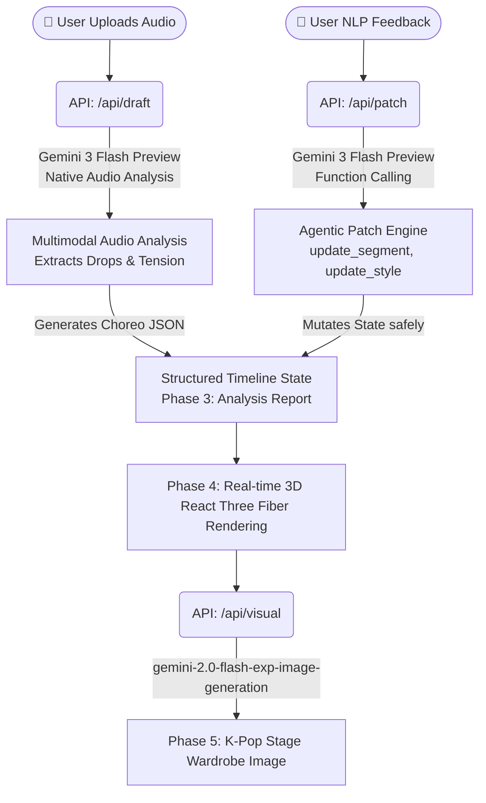

# ⚡️ SyncStage AI

> **"오디오 멀티모달 추론과 JSON 기반 타임라인 패치로 완성하는 K-Pop A&R 디렉터"**

🌐 **Live Demo:** [https://syncstage-ai.vercel.app](https://syncstage-ai.vercel.app)

## 📖 1. Product Overview (프로덕트 한 줄 요약)
**SyncStage AI**는 사용자가 데모 음원을 업로드하면, Gemini의 핵심 멀티모달 오디오 분석 능력을 통해 곡의 전개와 텐션을 파악하고 이에 맞는 3D 안무 타임라인과 무대 의상 컨셉을 자동 생성 및 리비전(Revision) 관리해 주는 **A&R 디렉팅 에이전트**입니다.

---

## 🏗️ 2. Architecture & Workflow



**단계별 데모 플로우 (Phase 0 → 5):**
1. **Phase 0 — Upload:** 사용자가 K-pop 데모 음원을 업로드하거나 내장 트랙을 선택합니다.
2. **Phase 1 — Ready:** 오디오 웨이브폼이 표시되고 분석 버튼이 활성화됩니다.
3. **Phase 2 — Analyzing:** Gemini 3 Flash Preview가 오디오를 직접 청취하여 드럼 킥·베이스 라인·비트 드롭 타임스탬프를 추출합니다.
4. **Phase 3 — Report:** AI 분석 리포트 (섹션 수, Beat Drop 타임스탬프, Energy Arc, 추천 무드) 를 표시합니다.
5. **Phase 4 — Choreography:** R3F 기반 3D 댄서 아바타가 타임라인에 맞춰 춤을 추고, 자연어 Patch 명령으로 실시간 수정됩니다.
6. **Phase 5 — Wardrobe:** 오디오 무드에서 도출된 프롬프트로 무대 의상 컨셉 이미지를 생성합니다.

---

## 🏆 3. Hackathon Judging Criteria (왜 SyncStage AI인가?)

심사 기준(엔터테인먼트 트랙)에 완벽히 부합하는 4가지 요소를 모두 갖추었습니다.

1. **Impact (25%) - K-Pop 산업의 막대한 소통 비용 절감**
   엔터테인먼트 강국 한국에서 A&R 디렉터, 안무가, 스타일리스트 간의 커뮤니케이션 오버헤드는 엄청납니다. SyncStage AI는 아이디어를 즉석에서 시각화하여 **빠른 프로토타이핑과 의사결정**을 돕는 강력한 B2B 솔루션입니다.
2. **Demo (50%) - 극한의 환경에서도 멈추지 않는 'Zero-Fail' 아키텍처**
   하드코딩된 'Golden Path Fallback' 로직을 겹겹이 설계하여, API Quota 초과나 Vercel 타임아웃 같은 라이브 해커톤 데모의 치명적 오류 상황에서도 **무조건 작동하는 프로덕션 레벨의 생존성(Resilience)**을 입증했습니다.
3. **Creativity (15%) - 비디오 제너레이션이 아닌 "데이터 오케스트레이션(JSON)"**
   무겁고 제어가 불가능한 비디오 생성형 AI를 쓰지 않았습니다. Gemini의 Function Calling 능력을 **'3D 상태(State)를 확정적으로 제어하는 Mutator'**로 재해석하여, 환각(Hallucination) 없이 정확한 구간(Segment)만 수정해내는 독창적인 접근법을 선보입니다.
4. **Pitch (10%) - 사용자와 AI의 완벽한 페어 플레이**
   단순한 결과물 출력이 아니라, 분석(Draft) ➡️ 적용(Visual) ➡️ 수정(Patch)으로 이어지는 사용자와 에이전트 간의 티키타카(Tiki-taka) 플로우를 직관적인 UI 페이즈(Phase 0~5)로 풀어냈습니다.

---

## ⚠️ 4. Original Contribution (독창적 기여 명시 - **중요**)

> **심사위원 필독 사항 (DQ 방지 명시)**
> 프로그램 내에 렌더링되는 **3D 아바타 모델과 애니메이션 파일 자체는 Mixamo의 오픈소스 에셋**을 활용했습니다.
> 하지만, 당 팀의 **독창적 기여(Original Contribution) 및 핵심 기술력은 "Gemini의 네이티브 오디오 멀티모달 추론을 통해 곡의 텐션을 분석하고, 이를 바탕으로 JSON 기반의 타임라인을 자동 오케스트레이션하며, 자연어 Function Calling을 통해 상태를 제어하는 '디렉터 에이전트 엔진(Director Agent Engine)'"을 100% 직접 기획하고 구현**했다는 점에 있습니다.

---

## 🛠️ 5. 사용한 Google 핵심 기술 (Tech Stack)

| 구분 | 사용 기술 | 구현 내용 및 역할 |
|---|---|---|
| **Audio Deep Listening** | **Gemini 3 Flash Preview** (`gemini-3-flash-preview`) | 별도의 오디오 전처리 파이프라인 없이, Gemini Files API로 MP3를 업로드 후 Native Audio 이해력으로 드럼 킥, 베이스 라인, 비트 드롭 타임스탬프를 직접 분석해 Choreo JSON 타임라인 생성 |
| **Agentic Function Calling** | **Gemini 3 Flash Preview** (Function Calling) | 사용자의 자연어 피드백(한국어 포함)을 `update_segment`, `update_style` 함수 도구(Tools)로 변환하여 사이드 이펙트 없이 3D 앱 상태를 안전하게 패치 |
| **Stage Visual Generation** | **Gemini Flash Image Generation** (`gemini-2.0-flash-exp-image-generation`) | 오디오 무드 분석에서 도출된 프롬프트를 바탕으로 K-Pop 무대 의상 컨셉 이미지 생성 (base64 inline 반환) |

---

## 🚀 6. How to Run (데모 실행 방법)

```bash
# Install dependencies
npm install

# Set your Gemini API key
echo "GEMINI_API_KEY=your_key_here" > .env.local

# Run dev server
npm run dev
```

Open [http://localhost:3000](http://localhost:3000)

*(내장 데모 트랙 버튼 `⚡ Use Built-in K-pop Demo Track`으로 즉시 체험 가능합니다. API 키가 있어야 실제 Gemini 분석이 작동합니다.)*

---

# ⚡️ SyncStage AI

> **"K-Pop A&R Director powered by Gemini Native Audio Multimodal Inference and JSON-based Timeline Patching"**

🌐 **Live Demo:** [https://syncstage-ai.vercel.app](https://syncstage-ai.vercel.app)

## 📖 1. Product Overview
**SyncStage AI** is an **A&R Directing Agent** that, when a user uploads a demo audio track, leverages Gemini's native multimodal audio analysis to identify the song's energy progression and tension. It then automatically generates a 3D choreography timeline and stage wardrobe concept — and allows real-time refinement through natural language Function Calling.

---

## 🏗️ 2. Architecture & Workflow
*(See Mermaid diagram above)*

**Phase-by-Phase Demo Flow:**
1. **Phase 0 — Upload:** User uploads a K-pop audio file or selects the built-in demo track.
2. **Phase 1 — Ready:** Audio waveform renders; Analyze button activates.
3. **Phase 2 — Analyzing:** Gemini 3 Flash Preview listens natively to the audio and extracts beat drop timestamps, energy arcs, and mood.
4. **Phase 3 — Report:** AI analysis report shown (sections, beat drop time, energy arc chart, recommended mood).
5. **Phase 4 — Choreography:** 3D dancer avatar performs the timeline; natural language patches apply in real time.
6. **Phase 5 — Wardrobe:** Stage costume concept image generated from the audio-derived prompt.

---

## ⚠️ 3. Original Contribution (**Important**)

> **Judge's Note (Notice to avoid DQ)**
> The **3D avatar models and animation files rendered within the program utilize open-source assets from Mixamo**.
> However, our team's **original contribution and core technical prowess lie in the 100% direct planning and implementation of the 'Director Agent Engine'**. This engine analyzes song tension through Gemini's native audio multimodal inference, automatically orchestrates JSON-based timelines, and controls 3D state through natural language Function Calling.

---

## 🛠️ 4. Key Google Technologies Used (Tech Stack)

| Category | Technology | Role |
|---|---|---|
| **Audio Deep Listening** | **Gemini 3 Flash Preview** (`gemini-3-flash-preview`) | Uploads audio via Gemini Files API and natively analyzes drum kicks, bass lines, and beat drop timestamps — no external audio preprocessing pipeline needed |
| **Agentic Function Calling** | **Gemini 3 Flash Preview** (Function Calling) | Converts natural language user feedback (including Korean) into `update_segment` / `update_style` tool calls to safely mutate 3D app state without side effects |
| **Stage Visual Generation** | **Gemini Flash Image Generation** (`gemini-2.0-flash-exp-image-generation`) | Generates K-Pop stage wardrobe concept images from audio mood-derived prompts, returned as base64 inline data |

---

## 🚀 5. How to Run

```bash
# Install dependencies
npm install

# Set your Gemini API key
echo "GEMINI_API_KEY=your_key_here" > .env.local

# Run dev server
npm run dev
```

Open [http://localhost:3000](http://localhost:3000)

*(Use the `⚡ Use Built-in K-pop Demo Track` button for an instant demo. A Gemini API key is required for live AI analysis.)*
