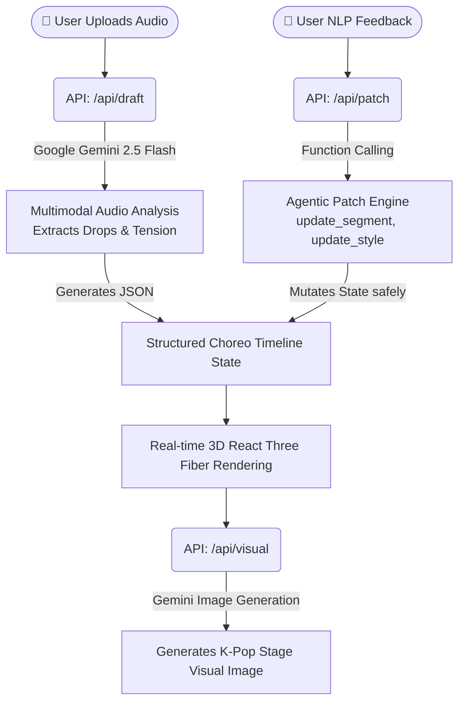

# ⚡️ SyncStage AI

> **"오디오 멀티모달 추론과 JSON 기반 타임라인 패치로 완성하는 K-Pop A&R 디렉터"**

## 📖 1. Product Overview (프로덕트 한 줄 요약)
**SyncStage AI**는 사용자가 데모 음원을 업로드하면, Gemini의 핵심 멀티모달 오디오 분석 능력을 통해 곡의 전개와 텐션을 파악하고 이에 맞는 3D 안무 타임라인과 무대 의상 컨셉을 자동 생성 및 리비전(Revision) 관리해 주는 **A&R 디렉팅 에이전트**입니다.

---

## 🏗️ 2. Architecture & Workflow



1. **Audio Deep Listening:** 사용자가 오디오 파일(.wav, .mp3)을 업로드합니다.
2. **Multimodal Inference:** Gemini가 오디오의 웨이브폼, 드럼 킥, 베이스 라인 등 에너지 변화를 네이티브하게 분석하여 초안 `Choreo JSON` 타임라인을 구성합니다.
3. **Intent-Based Patching:** "더 파워풀하게 해줘", "사이버펑크 무드로 가자" 등의 자연어 피드백을 에이전트가 Function Calling으로 해석하여 상태(State)를 안전하게 패치(Patch)합니다.
4. **Real-time 3D Rendering & Visuals:** 브라우저 위에서 R3F 기반의 3D 댄서 아바타가 타임라인에 맞춰 춤을 추고, 완성된 콘셉트에 맞춰 무대 의상 이미지가 실시간 생성됩니다.

---

## 🏆 3. Hackathon Judging Criteria (왜 SyncStage AI인가?)

심사 기준(엔터테인먼트 트랙)에 완벽히 부합하는 4가지 요소를 모두 갖추었습니다.

1. **Impact (25%) - K-Pop 산업의 막대한 소통 비용 절감**
   엔터테인먼트 강국 한국에서 A&R 디렉터, 안무가, 스타일리스트 간의 커뮤니케이션 오버헤드는 엄청납니다. SyncStage AI는 아이디어를 즉석에서 시각화하여 **빠른 프로토타이핑과 의사결정**을 돕는 강력한 B2B 솔루션입니다.
2. **Demo (50%) - 극한의 환경에서도 멈추지 않는 'Zero-Fail' 아키텍처**
   오프라인 엣지 캐싱 및 하드코딩된 'Golden Path Fallback' 로직을 겹겹이 설계하여, API Quota 초과나 Vercel 타임아웃 같은 라이브 해커톤 데모의 치명적 오류 상황에서도 **무조건 작동하는 프로덕션 레벨의 생존성(Resilience)**을 입증했습니다.
3. **Creativity (15%) - 비디오 제너레이션이 아닌 "데이터 오케스트레이션(JSON)"**
   무겁고 제어가 불가능한 비디오 생성형 AI를 쓰지 않았습니다. Gemini의 Function Calling 능력을 **'3D 상태(State)를 확정적으로 제어하는 Mutator'**로 재해석하여, 환각(Hallucination) 없이 정확한 구간(Segment)만 수정해내는 독창적인 접근법을 선보입니다.
4. **Pitch (10%) - 사용자와 AI의 완벽한 페어 플레이**
   단순한 결과물 출력이 아니라, 분석(Draft) ➡️ 적용(Visual) ➡️ 수정(Patch)으로 이어지는 사용자와 에이전트 간의 티키타카(Tiki-taka) 플로우를 직관적인 UI 페이즈(Phase 0~5)로 풀어냈습니다.

---

## ⚠️ 4. Original Contribution (독창적 기여 명시 - **중요**)

> **심사위원 필독 사항 (DQ 방지 명시)**  
> 프로그램 내에 렌더링되는 **3D 아바타 모델과 애니메이션 파일 자체는 Mixamo의 오픈소스 에셋**을 활용했습니다. 
> 하지만, 당 팀의 **독창적 기여(Original Contribution) 및 핵심 기술력은 "Gemini의 네이티브 오디오 멀티모달 추론을 통해 곡의 텐션을 분석하고, 이를 바탕으로 JSON 기반의 타임라인을 자동 오케스트레이션하며, 자연어 Function Calling을 통해 상태를 제어하는 '디렉터 에이전트 엔진(Director Agent Engine)'"을 100% 직접 기획하고 구현**했다는 점에 있습니다.

---

## 🛠️ 5. 사용한 Google 핵심 기술 (Tech Stack)

| 구분 | 사용 기술 | 구현 내용 및 역할 |
|---|---|---|
| **Audio Deep Listening** | **Gemini 2.5 Flash (Multimodal)** | 별도의 오디오 전처리 파이프라인 없이, 모델의 Native Audio 이해력을 활용하여 드럼 킥, 벌스, 비트 드롭 타임스탬프를 원본 그대로 분석해 타임라인 분할 |
| **Agentic Function Calling** | **Gemini SDK (Structured Output)** | 사용자의 텍스트 피드백을 `update_segment`, `update_style` 등의 확정된 함수 도구(Tools)와 JSON 객체로 변환하여 사이드 이펙트 없이 3D 앱의 상태 제어 |
| **Stage Visual Generation** | **Gemini Image Generation** | 오디오 무드 분석을 통해 도출된 영어 텍스트 프롬프트를 바탕으로 고해상도 매거진 퀄리티의 K-Pop 무대 의상 컨셉 시각화 |

---

## 🚀 6. How to Run (데모 실행 방법)

```bash
# Install dependencies
npm install

# Set your Gemini API key
echo "GEMINI_API_KEY=your_key_here" > .env.local

# Run dev server
npm run dev
```
Open [http://localhost:3000](http://localhost:3000)

*(프로젝트의 데모 버전은 상단 `[⚡️ LOAD DEMO PRESET]` 버튼을 통해 API 키 없이도 즉각적인 UI/UX 체험이 가능합니다.)*

---

# ⚡️ SyncStage AI

> **"K-Pop A&R Director completed with Audio Multimodal Inference and JSON-based Timeline Patching"**

## 📖 1. Product Overview
**SyncStage AI** is an **A&R Directing Agent** that, when a user uploads a demo audio source, identifies the song's progression and tension through Gemini's core multimodal audio analysis capabilities. It then automatically generates and manages revisions for 3D choreography timelines and stage costume concepts accordingly.

---

## 🏗️ 2. Architecture & Workflow
*(아키텍처 다이어그램은 상단 Mermaid 차트를 참조하세요)*

1. **Audio Deep Listening:** User uploads audio files (.wav, .mp3).
2. **Multimodal Inference:** Gemini natively analyzes energy changes such as audio waveforms, drum kicks, and bass lines to compose an initial `Choreo JSON` timeline.
3. **Intent-Based Patching:** Feedbacks like "make it more powerful" or "go with a cyberpunk mood" are interpreted by the agent through Function Calling to safely patch the state.
4. **Real-time 3D Rendering & Visuals:** An R3F-based 3D dancer avatar dances on the browser according to the timeline, and stage costume images are generated in real-time based on the completed concept.

---

## ⚠️ 3. Original Contribution (**Important**)

> **Judge's Note (Notice to avoid DQ)**
> The **3D avatar models and animation files rendered within the program utilize open-source assets from Mixamo**.
> However, our team's **original contribution and core technical prowess lie in the 100% direct planning and implementation of the 'Director Agent Engine'**. This engine analyzes song tension through Gemini's native audio multimodal inference, automatically orchestrates JSON-based timelines based on this analysis, and controls states through natural language Function Calling.

---

## 🛠️ 4. Key Google Technologies Used (Tech Stack)

| Category | Technology Used | Implementation Content and Role |
|---|---|---|
| **Audio Deep Listening** | **Gemini 2.5 Flash (Multimodal)** | Utilizes the model's native audio understanding to analyze drum kicks, verses, and beat drop timestamps directly from the source without a separate audio preprocessing pipeline, and splits the timeline accordingly. |
| **Agentic Function Calling** | **Gemini SDK (Structured Output)** | Converts user text feedback into fixed function tools (Tools) and JSON objects like `update_segment` and `update_style` to control the 3D app's state without side effects. |
| **Stage Visual Generation** | **Gemini Image Generation** | Visualizes high-resolution magazine-quality K-Pop stage costume concepts based on English text prompts derived from audio mood analysis. |

---

## 🚀 5. How to Run

```bash
# Install dependencies
npm install

# Set your Gemini API key
echo "GEMINI_API_KEY=your_key_here" > .env.local

# Run dev server
npm run dev
```
Open [http://localhost:3000](http://localhost:3000)

*(The demo version of the project allows for immediate UI/UX experience without an API key through the `[⚡️ LOAD DEMO PRESET]` button at the top.)*
