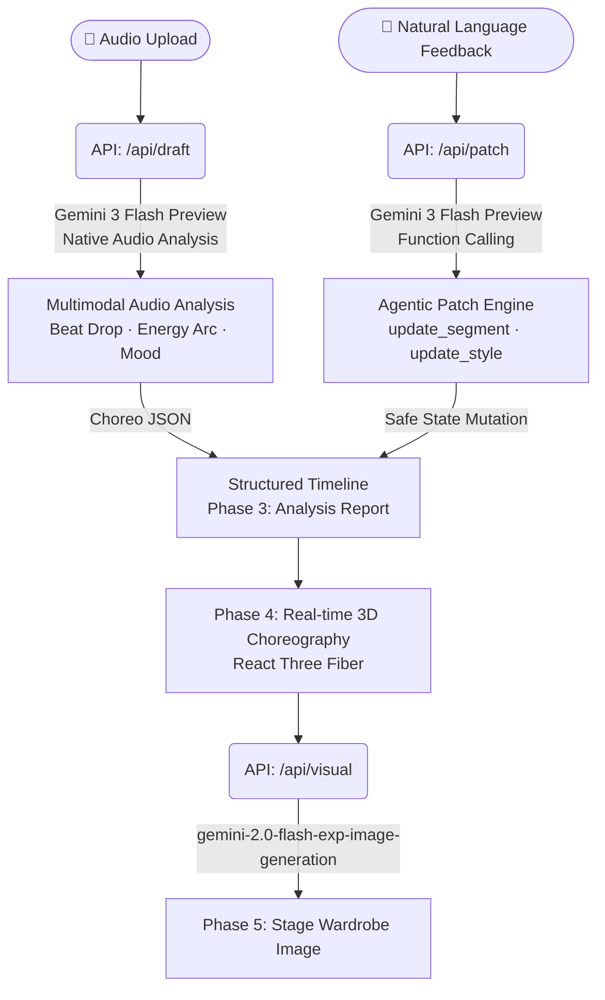

# ⚡️ SyncStage AI

> **K-Pop A&R Director powered by Gemini Native Audio Multimodal Intelligence**
>
> **Gemini 네이티브 오디오 멀티모달 분석으로 완성하는 K-Pop A&R 디렉터**

🌐 **Live Demo:** [https://syncstage-ai.vercel.app](https://syncstage-ai.vercel.app)

---

## 🎤 Entertainment × Gemini

> *"한국, 특히 서울은 엔터테인먼트 분야의 글로벌 강국입니다. Google의 AI 제품을 활용하여 음악, TV, 영화, 게임 전반에 걸쳐 혁신적인 경험을 어떻게 만들 수 있을까요?"*
>
> *"Korea, especially Seoul, is a global powerhouse in entertainment. How can Google's AI products be used to create innovative experiences across music, TV, film, and games?"*

K-Pop 무대를 만들기 위해 A&R 디렉터, 안무가, 스타일리스트가 수십 번씩 피드백을 주고받는 비용은 막대합니다. **SyncStage AI**는 Gemini의 네이티브 오디오 이해력을 활용해, 음원 하나로 안무 타임라인과 무대 의상 컨셉을 즉시 시각화하고 자연어로 수정하는 **AI A&R 디렉팅 에이전트**입니다.

Producing a K-Pop stage requires A&R directors, choreographers, and stylists to exchange feedback dozens of times. **SyncStage AI** leverages Gemini's native audio understanding to instantly visualize a choreography timeline and stage wardrobe concept from a single audio track — then refine it through natural language.

---

## 📖 Product Overview

| | 한국어 | English |
|---|---|---|
| **What** | 음원 업로드 → 자동 안무 타임라인 + 무대 의상 컨셉 생성 | Upload audio → auto-generate choreography timeline + stage wardrobe concept |
| **How** | Gemini 네이티브 오디오 분석 + Function Calling 에이전트 | Gemini native audio analysis + Function Calling agent |
| **For whom** | A&R 디렉터, 안무가, 스타일리스트 | A&R directors, choreographers, stylists |

---

## 🏗️ Architecture & Workflow



**Demo Flow (Phase 0 → 5):**

| Phase | Action | 설명 / Description |
|---|---|---|
| 0 | **Upload** | K-pop 음원 업로드 또는 내장 트랙 선택 · Upload audio or use built-in demo track |
| 1 | **Ready** | 오디오 웨이브폼 표시, 분석 버튼 활성화 · Waveform renders, Analyze button activates |
| 2 | **Analyzing** | Gemini가 드럼 킥·베이스·비트 드롭 타임스탬프 직접 청취 · Gemini natively listens and extracts beat drop timestamps |
| 3 | **Report** | AI 분석 리포트 (섹션 수, Beat Drop 타임, Energy Arc) · AI analysis report shown |
| 4 | **Choreography** | 3D 댄서가 타임라인에 맞춰 춤추고 자연어로 실시간 수정 · 3D dancer performs; natural language patches apply in real time |
| 5 | **Wardrobe** | 오디오 무드에서 도출된 무대 의상 컨셉 이미지 생성 · Stage wardrobe concept image generated from audio mood |

---

## 🛠️ Key Google Technologies

| Category | Technology | Role |
|---|---|---|
| **Audio Intelligence** | **Gemini 3 Flash Preview** (`gemini-3-flash-preview`) | Directly analyzes drum kicks, bass lines, and beat drop timestamps from raw MP3 via Gemini Files API — no external audio preprocessing library needed |
| **Agentic Function Calling** | **Gemini 3 Flash Preview** (Function Calling) | Converts natural language feedback (Korean & English) into `update_segment` / `update_style` tool calls — safely mutates only the targeted 3D state |
| **Visual Generation** | **Gemini Flash Image Generation** (`gemini-2.0-flash-exp-image-generation`) | Generates K-Pop stage wardrobe concept images from audio mood-derived prompts, returned as inline base64 |

---

## ✨ Key Features

- **Single-API Audio Intelligence** — MP3 파일 하나로 곡의 구조·텐션·무드를 단일 Gemini 호출로 분석. No external BPM/spectrum libraries.
- **Intent-based Patching** — Function Calling을 "State Mutator"로 활용. 전체 상태 덮어쓰기 없이 정확한 세그먼트만 수정. The agent understands *intent*, not just keywords.
- **Cross-modal Reasoning** — 오디오 무드 분석 결과가 의상 이미지 프롬프트로 자동 연결. Audio vibe directly drives the visual generation prompt in a single reasoning chain.

---

## ⚠️ Original Contribution

> 3D 아바타 모델·애니메이션 파일은 **Mixamo 오픈소스 에셋**을 사용했습니다.
>
> The 3D avatar models and animation files use **Mixamo open-source assets**.

본 팀의 독창적 기여는 **Gemini 네이티브 오디오 추론으로 곡의 텐션을 분석하고, JSON 기반 타임라인을 오케스트레이션하며, 자연어 Function Calling으로 3D 상태를 제어하는 Director Agent Engine**을 100% 직접 설계·구현한 것입니다.

Our original contribution is the **Director Agent Engine** — 100% built from scratch — which analyzes song tension through Gemini's native audio inference, orchestrates a JSON-based timeline, and controls 3D state through natural language Function Calling.

---

## 🚀 How to Run

```bash
npm install
echo "GEMINI_API_KEY=your_key_here" > .env.local
npm run dev
```

Open [http://localhost:3000](http://localhost:3000)

`⚡ Use Built-in K-pop Demo Track` 버튼으로 즉시 체험 가능. API 키가 있어야 실제 Gemini 분석이 작동합니다.

Click `⚡ Use Built-in K-pop Demo Track` for an instant demo. A Gemini API key is required for live AI analysis.
