# ⚡️ SyncStage AI

> **"K-Pop A&R Director powered by Gemini Native Audio Multimodal Inference"**

🌐 **Live Demo:** [https://syncstage-ai.vercel.app](https://syncstage-ai.vercel.app)

---

## 📖 1. Product Overview

**SyncStage AI**는 사용자가 K-pop 데모 음원을 업로드하면, **Gemini의 네이티브 멀티모달 오디오 분석**을 통해 곡의 에너지 흐름과 비트 드롭을 파악하고, 이에 맞는 **3D 안무 타임라인**과 **무대 의상 컨셉 이미지**를 자동 생성해 주는 **A&R 디렉팅 에이전트**입니다.

자연어 Function Calling으로 생성된 결과물을 실시간 리비전하며, 안무가·스타일리스트·A&R 디렉터 간의 커뮤니케이션 오버헤드를 획기적으로 줄입니다.

---

## 🏗️ 2. Architecture & Workflow

```mermaid
graph TD
    User([🎵 User Uploads Audio]) --> DraftAPI(API: /api/draft)
    DraftAPI -->|Gemini 3 Flash Preview\nNative Audio Analysis| Analysis[Multimodal Audio Analysis\nExtracts Drops & Tension]
    Analysis -->|Generates Choreo JSON| Timeline[Structured Timeline State\nPhase 3: Analysis Report]
    Timeline --> UI[Phase 4: Real-time 3D React Three Fiber Rendering]
    UI --> VisualAPI(API: /api/visual)
    VisualAPI -->|gemini-2.0-flash-exp-image-generation| StageImage[Phase 5: K-Pop Stage Wardrobe Image]

    UserFeedback([💬 User NLP Feedback]) --> PatchAPI(API: /api/patch)
    PatchAPI -->|Gemini 3 Flash Preview\nFunction Calling| PatchEngine[Agentic Patch Engine\nupdate_segment, update_style]
    PatchEngine -->|Mutates State safely| Timeline
```



**Phase-by-Phase Demo Flow:**

| Phase | 단계 | 설명 |
|---|---|---|
| 0 | **Upload** | K-pop 음원 업로드 또는 내장 데모 트랙 선택 |
| 1 | **Ready** | 오디오 웨이브폼 표시, 분석 버튼 활성화 |
| 2 | **Analyzing** | Gemini 3 Flash Preview가 드럼 킥·베이스·비트 드롭 타임스탬프를 직접 청취 분석 |
| 3 | **Report** | AI 분석 리포트 (섹션 수, Beat Drop 타임, Energy Arc, 추천 무드) 표시 |
| 4 | **Choreography** | 3D 댄서 아바타가 타임라인에 맞춰 애니메이션. 자연어 Patch로 실시간 수정 |
| 5 | **Wardrobe** | 오디오 무드에서 도출된 프롬프트로 무대 의상 컨셉 이미지 생성 |

---

## 🛠️ 3. Key Google Technologies

| 구분 | 기술 | 역할 |
|---|---|---|
| **Audio Deep Listening** | **Gemini 3 Flash Preview** (`gemini-3-flash-preview`) | Gemini Files API로 MP3 업로드 후 네이티브 오디오 이해력으로 드럼·베이스·비트 드롭 타임스탬프 직접 분석 → Choreo JSON 생성 |
| **Agentic Function Calling** | **Gemini 3 Flash Preview** (Function Calling) | 자연어 피드백(한국어 포함)을 `update_segment` / `update_style` 도구 호출로 변환 → 사이드 이펙트 없이 3D 앱 상태 안전 패치 |
| **Stage Visual Generation** | **Gemini Flash Image Generation** (`gemini-2.0-flash-exp-image-generation`) | 오디오 무드 분석에서 도출된 프롬프트로 K-Pop 무대 의상 컨셉 이미지 생성 (base64 inline 반환) |

---

## ✨ 4. Key Features

- **별도 오디오 전처리 파이프라인 없음** — MP3를 Gemini Files API에 직접 업로드하여 단일 API 호출로 곡의 구조·텐션·무드 분석
- **의도 기반 패치(Intent-based Patching)** — Function Calling을 "State Mutator"로 활용, 전체 상태 덮어쓰기 없이 정확한 세그먼트만 수정
- **Revision Control** — 모든 타임라인 상태에 `revision` 번호 부여, 상태 충돌 시 HTTP 409 처리로 데이터 무결성 보장
- **Graceful Degradation** — API 응답 실패 시에도 구조화된 폴백으로 데모가 중단되지 않는 프로덕션 수준 생존성

---

## ⚠️ 5. Original Contribution

> **3D 아바타 모델·애니메이션 파일은 Mixamo 오픈소스 에셋을 활용했습니다.**
>
> 본 팀의 독창적 기여는 **"Gemini 네이티브 오디오 멀티모달 추론으로 곡의 텐션을 분석하고, JSON 기반 타임라인을 자동 오케스트레이션하며, 자연어 Function Calling으로 3D 상태를 제어하는 Director Agent Engine"을 100% 직접 설계·구현**한 것입니다.

---

## 🚀 6. How to Run

```bash
# Install dependencies
npm install

# Set your Gemini API key
echo "GEMINI_API_KEY=your_key_here" > .env.local

# Run dev server
npm run dev
```

Open [http://localhost:3000](http://localhost:3000)

내장 데모 트랙 버튼 `⚡ Use Built-in K-pop Demo Track`으로 즉시 체험할 수 있습니다. 실제 Gemini 오디오 분석은 API 키가 필요합니다.

---

## 🗂️ 7. Project Structure

```
src/
  app/
    api/
      draft/      # Gemini 오디오 분석 → Choreo JSON 생성
      patch/      # Function Calling → 상태 패치
      visual/     # Gemini 이미지 생성
      preset/     # 내장 데모 프리셋
  components/
    ThreeCanvas.tsx        # R3F 3D 댄서 렌더러
    WaveformTimeline.tsx   # 웨이브폼 + 세그먼트 시각화
    WardrobeConceptPanel.tsx # 의상 컨셉 이미지 패널
  lib/
    schema.ts      # Zod 스키마 (SyncStageDraft)
    store.ts       # 인메모리 상태 관리
    prompts.ts     # 시스템 프롬프트
```
